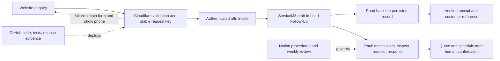

# VFC operating baseline — 7 October 2026

**Live intake verified 8 October 2026:** public website capture, provider readback, assigned owner/queue, identical retry, invalid-consent rejection and synthetic cleanup all passed. See [the production proof](evidence/2026-10-08-public-intake.json). The prior Cloudflare deployment blocker is resolved; no dashboard sign-in is needed.

Deployment used the registered Cloudflare credential in Built-to-Own and the registered n8n credential in EGI, each within its existing runtime. No provider credential was copied. A scoped application token was provisioned in the VFC Pages production secret and protected n8n ingress; temporary bootstrap repository secrets were removed after configuration. No new provider, subscription, queue service or background job was added. Production settings were independently read back and the public deployment source matched `c66a59ff1d778b5b07b99bd416ece698016d1e2a`. Future activation must preserve both sides of the ingress token together; the single-runtime deployment helper requires both registered provider capabilities and is not available in the EGI-only context today.

The current readiness register and weekly review live in [Command & Source of Truth](https://app.notion.com/p/0c895c346a0b410bb7871f966291f28d). ServiceM8 owns customer/job data; GitHub owns versioned implementation. Older audit sections are dated history, not current readiness.

## Enquiry contract

This describes the verified implementation; deployment status must be read from the current readiness register. A successful workflow HTTP response is insufficient. The website requires a matching correlation ID, request key, ServiceM8 UUID and verified persistence receipt. Replays use the same deterministic UUID and do not overwrite the original job. A new successful form submission gets a new ID. The form retains details on failure and offers 0402 221 071.

Intake creates an unpriced Quote draft, assigned to Paul in Lead Follow-Up. Contact details are preserved in the description; the operator must match/create the correct customer before issuing a quote. It never schedules, sends messages, invoices or collects payment. Photos are requested during follow-up; uploads are disabled until durable attachment capture is implemented. Privacy consent is not marketing consent.

The n8n definition uses the existing protected VFC credential. `scripts/build_intake_workflow.py` generates it. `scripts/deploy_verified_intake.py` uses the registered EGI ServiceM8 adapter and existing Actions secrets, stages a synthetic record, tests replay/authentication, rereads the record and closes it. Promotion requires `VFC_PROMOTE=true`, preserves Pages environment settings, and replaces only the known VFC workflow. Never commit the ingress token. Publish a fresh Pages deployment after updating its environment, then prove the public website route independently.

If capture fails, keep the strict website receipt check. Do not restore the old false-success behaviour. Deactivate the intake if integrity is in doubt; the website will preserve details and display its phone fallback. Restore the prior verified workflow/environment pair only from a protected backup, redeploy, then repeat synthetic proof. Reconcile a timed-out submission by its intake key before creating another record.

## Minimum job and message standards

The existing ServiceM8 SAMPLE Help Guide job contains two reference notes: **VFC MINIMUM JOB STANDARD v1** and **VFC ROUTINE MESSAGE MASTERS v1**. Copy their checklist/text into actual jobs as appropriate. They are saved references, not native job templates, automatic messages or native merge fields. Do not service the sample job.

Every genuine job needs an owner, next action/due time, lead source, received/first human response timestamps, confirmed scope, evidence before/after, actual labour/travel/admin time, verified aftercare and invoice/payment reconciliation. Routine messages use a verified VFC sender and stay on the job. VFC marketing in CAMÉE remains on hold pending separate sender/consent verification.

## Ten-minute weekly review

Owner: Paul-Michael Haik. Cadence: Friday, 16:00 Australia/Perth; first review 9 October 2026. Use the existing Notion command page; no second customer register or new subscription.

1. Count genuine new leads by source; exclude SAMPLE, BVP CUSTOMER ZERO and other test records.
2. Review median first human response time and missing response timestamps. The ten-minute intake target is an internal aspiration, not a published guarantee; record after-hours cases separately.
3. Count quotes sent and accepted for the same cohort. Show numerator/denominator; use N/A when the denominator is zero.
4. Total actual productive, travel and admin hours; record missing time rather than treating it as zero.
5. Review genuine overdue invoices from recorded due dates/payment evidence. Pick one improvement with an owner and next due date.

Baseline on 7 October: zero genuine jobs in the connected VFC tenant; all returned records are sample/synthetic. Response time, conversion and utilisation are not measurable. Genuine overdue invoices: none in the returned job set; sample balances are excluded. No claim of measured performance uplift is justified yet.

## Scope of readiness

GST 10% is the observed default. Four sample forms and zero native job templates are present. The saved-checklist fallback is installed. Full launch readiness remains gated by geography confirmation, business sender evidence and complete customer lifecycle proof. A successful intake proof must never be promoted into a claim that quoting, scheduling, invoicing, payment and marketing are all ready.
